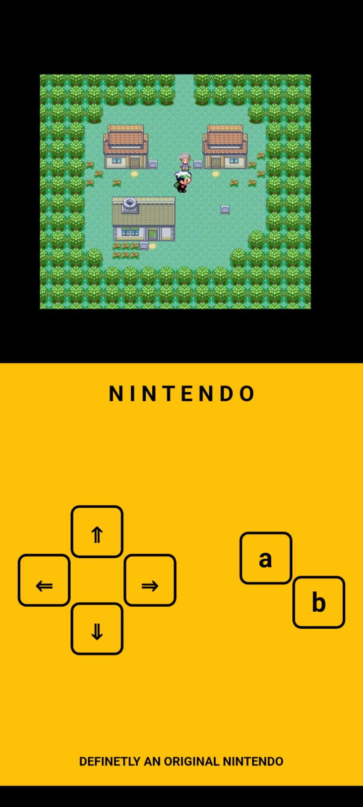
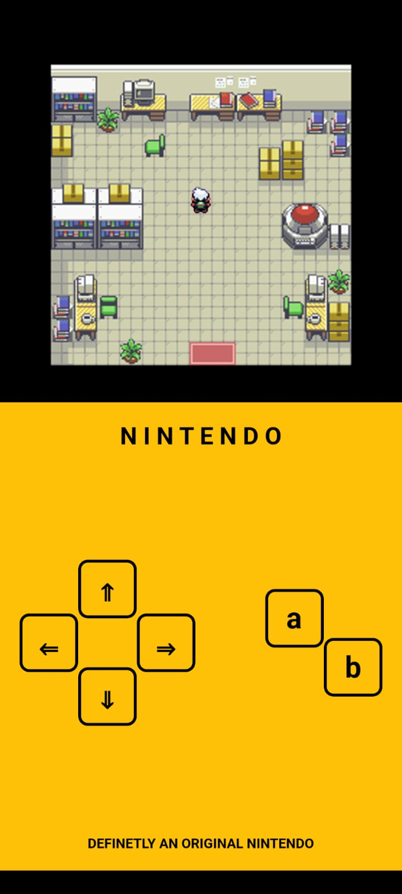
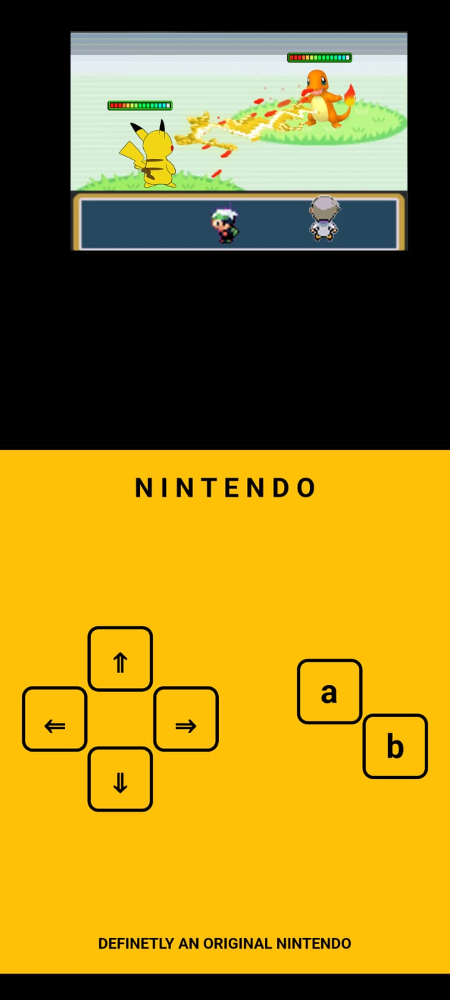

# nintendo-gameboy

This is a Flutter Game Development MVP (Minimum Viable Product) repository! With this MVP, you'll be able to create simple 2D games that work seamlessly on both Android and iOS devices. Check the testing details below to see the current implementation.

The current MVP implements:
- Character Movements
- Character Animation
- Use of various flutter widgets

## Getting Started
To contribute to this open-source MVP and get started follow these steps:

### Prerequisites
Before you begin, ensure you have met the following requirements:

- Flutter is installed on your development machine.
- An integrated development environment (IDE) like Android Studio or Visual Studio Code with the Flutter plugin.

### Installation
- Clone this repository to your local machine using:
  ```
  git clone https://github.com/Darshan-D/nintendo-gameboy
  ```
- Open your preferred IDE
- Attach the emulator/simulator
- Run the following command
  ```
  flutter run
  ```

## Testing
Here is the output of the current MVP:
<p float="left">
  
   
  
</p>
PS: Yes, I am aware of that typo in "Definetly" ... and it's intentional !

## Try out the app for yourself!
- This is just an MVP and not a production-ready app i.e. there are quite a few bugs!
- This is to showcase only the character movements and animations using flutter widgets i.e. this is not meant to be played as a game
- Available for Android 10+ : [Google Drive Link for APK file](https://shorturl.at/quBP1)

